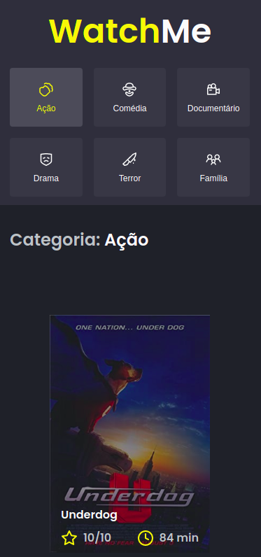
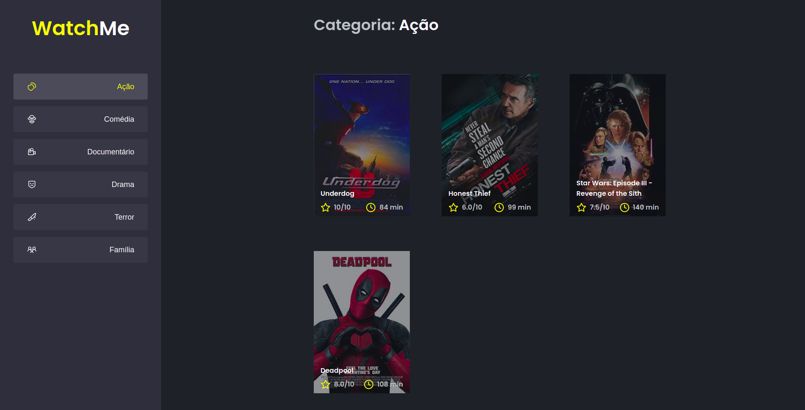

<h1 align="center"> 
	Watch Me 
</h1>

<h4 align="center"> 
	Projeto concluído! 
</h4>
<p align="left">Watch me é o segundo desafio do primeiro capítulo da trilha de ReactJS do Ignite, bootcamp da Rocketseat. Neste desafio, o objetivo principal é separar a aplicação em componentes, deixando o código mais limpo proporcionando uma melhor manutenção do mesmo. Como adicional, desenvolvi a responsividade da aplicação com base no layout original através das media queries do CSS. Os dados dos filmes e das categorias foram obtidos de uma api fake, o que premite que o dev front-end consiga trabalhar com dados dinâmicos mesmo que o back-end da aplicação não esteja pronto.</p>

### Tecnologias utilizadas
---

* ReactJS (CRA)
* TypeScript
* Sass
* JSON Server

### Features
---

- [x] Exibição de filmes por categoria
- [x] Responsividade
- [x] Fake api com JSON Server

### Screenshots
---

* Mobile


* Web


### Como instalar
---

```bash
# Clone este repositório
$ git clone https://github.com/mayconrr13/desafio2-ignite.git

# Instale as dependências
$ yarn 

# Execute a aplicação a fake api do JSON server
$ yarn server

# Execute a aplicação ReactJS
$ yarn dev

# Acesse a aplicação
$ http://localhost:8080
```

### Autor
---

Maycon dos Reis Rosário

### Entre em contato!

[](https://www.linkedin.com/in/mayconreisrosario/) 
[](mailto:mayconrr13@gmail.com)
